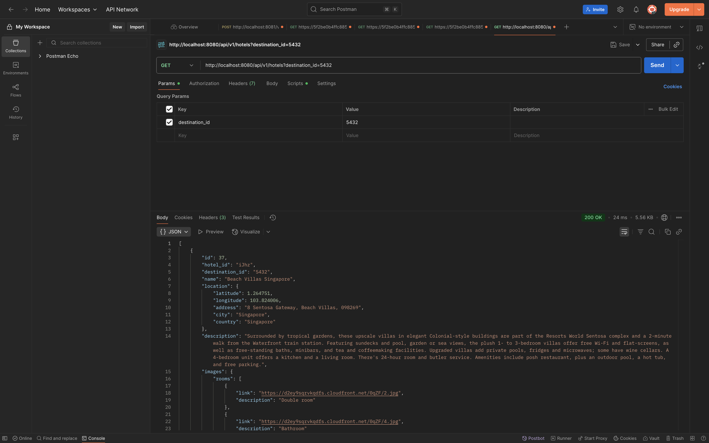

# Ascenda Challenges: Hotels Data Merge

This repository contains main part of the solution for the Ascenda Challenges: Hotels Data Merge. The goal of this challenge is to merge datasets containing hotel information from different sources, ensuring data consistency and accuracy.

## Prequisites

- Go version 1.24
- A running PostgreSQL instance
- Docker and Docker-compose for e2e tests
- Atlas CLI for database migration. Here is the [link](https://atlasgo.io/docs).

## Solution Overview

The solution includes 2 repositories:
- This repository, including the main code to serve the merged hotels data by destination_id and hotel_ids with unit tests and e2e tests with docker-compose
- The crawler repository as this [link](https://github.com/duylamasd/hotels-merge-crawler/tree/main)

Let's dive into the details of the solution.

## Solution Design


Let's talk about the components in the diagram:

### Data Sources

As the challenge states, we have 3 data sources: acme, patagonia and paperflies. Each source provides hotel data in different formats and structures.

### Crawler

The code for the crawler is in this [link](https://github.com/duylamasd/hotels-merge-crawler/tree/main).
The flow of the crawler is as follows:


In the step of merging, validating and cleaning data, the crawler performs the following tasks:
- **Fetching**: Retrieves data from the three sources (acme, patagonia, paperflies) using their respective APIs. The implementation is in `HotelCrawlerSource.crawl` of each data source, shown in this [link](https://github.com/duylamasd/hotels-merge-crawler/blob/main/src/crawler.py#L341).
- **Merging**: Combines data from different sources based on common identifiers (e.g., hotel_id, destination_id). For conflicting data, the priority is given to data sources depends on fields as follows:
  - `name`: `acme.name || patagonia.name || paperflies.hotel_name`
  - `location.latitude`: `acme.Latitude || patagonia.lat`
  - `location.longitude`: `acme.Longiude || patagonia.lng`
  - `location.address`: `patagonia.address || paperflies.location.address || acme.Address`
  - `location.city`: `acme.City`
  - `location.country`: `paperflies.country || acme.Country`
  - `description: paperflies.details || patagonia.info || acme.Description`
  - `images`: merge all unique images from all sources
    - `rooms`: `patagonia.images.rooms + paperflies.images.rooms`
    - `site`: `paperflies.images.site`
    - `amenities`: `patagonia.images.amenities`
  - `amenities`: `paperflies.amenities` 
  - `booking_conditions`: `paperflies.booking_conditions`
The above logic is implemented in the `HotelCrawlerSources.merge_data` method in this [link](https://github.com/duylamasd/hotels-merge-crawler/blob/main/src/crawler.py#L202)
- **Storing**: In one single database transaction, the crawler delete all hotels from previous syncs, then saves the cleaned and merged data into a PostgreSQL database. The implementation is in `Persistent.sync_hotels` method in this [link](https://github.com/duylamasd/hotels-merge-crawler/blob/main/src/persistent.py#L13).

### Database

For this challenge, I chose PostgreSQL as the database to store the cleaned and merged hotel data. The database schema is designed to accommodate the merged data structure, ensuring efficient querying and retrieval, especially the nested fields like `location`, `images` and `amenities`.
Here is the database schema and indices:

```sql
CREATE TABLE IF NOT EXISTS hotels (
  id SERIAL PRIMARY KEY,
  hotel_id TEXT UNIQUE NOT NULL,
  destination_id TEXT NOT NULL,
  name TEXT NOT NULL,
  location JSONB,
  description TEXT,
  images JSONB,
  amenities JSONB,
  booking_conditions TEXT[],
  created_at TIMESTAMPTZ DEFAULT NOW(),
  updated_at TIMESTAMPTZ DEFAULT NOW()
);

CREATE INDEX IF NOT EXISTS idx_hotels_destination_id ON hotels(destination_id);
```

From the requirement of searching hotels either by `destination_id` or `hotel_ids`, I created an index on the `destination_id` field to optimize query performance. Plus, a unique for `hotel_id` to ensure no duplicate hotels.
There's also a `updated_at` field to track the last update time of each record. For the scope of this challenge, I did not implement incremental updates, so the crawler deletes all previous records and inserts new ones in each sync. So, the `created_at` and `updated_at` are showing the timestamp of the last sync.

### API
As the challenge states, I built a RESTful API using `Go` with `Gin`, `fx` and `sqlc`. The API provides endpoint to retrieve hotel information based on `destination_id` or a list of `hotel_ids` as `/api/v1/hotels`
Here is an example request:
```http
GET /api/v1/hotels?destination_id=5432 HTTP/1.1
Host: localhost:8080
```

Here is an example of the response
<details>
<summary>Response Example</summary>

```json
[
    {
        "id": 37,
        "hotel_id": "iJhz",
        "destination_id": "5432",
        "name": "Beach Villas Singapore",
        "location": {
            "latitude": 1.264751,
            "longitude": 103.824006,
            "address": "8 Sentosa Gateway, Beach Villas, 098269",
            "city": "Singapore",
            "country": "Singapore"
        },
        "description": "Surrounded by tropical gardens, these upscale villas in elegant Colonial-style buildings are part of the Resorts World Sentosa complex and a 2-minute walk from the Waterfront train station. Featuring sundecks and pool, garden or sea views, the plush 1- to 3-bedroom villas offer free Wi-Fi and flat-screens, as well as free-standing baths, minibars, and tea and coffeemaking facilities. Upgraded villas add private pools, fridges and microwaves; some have wine cellars. A 4-bedroom unit offers a kitchen and a living room. There's 24-hour room and butler service. Amenities include posh restaurant, plus an outdoor pool, a hot tub, and free parking.",
        "images": {
            "rooms": [
                {
                    "link": "https://d2ey9sqrvkqdfs.cloudfront.net/0qZF/2.jpg",
                    "description": "Double room"
                },
                {
                    "link": "https://d2ey9sqrvkqdfs.cloudfront.net/0qZF/4.jpg",
                    "description": "Bathroom"
                },
                {
                    "link": "https://d2ey9sqrvkqdfs.cloudfront.net/0qZF/2.jpg",
                    "description": "Double room"
                },
                {
                    "link": "https://d2ey9sqrvkqdfs.cloudfront.net/0qZF/3.jpg",
                    "description": "Double room"
                }
            ],
            "site": [
                {
                    "link": "https://d2ey9sqrvkqdfs.cloudfront.net/0qZF/1.jpg",
                    "description": "Front"
                }
            ],
            "amenities": [
                {
                    "link": "https://d2ey9sqrvkqdfs.cloudfront.net/0qZF/0.jpg",
                    "description": "RWS"
                },
                {
                    "link": "https://d2ey9sqrvkqdfs.cloudfront.net/0qZF/6.jpg",
                    "description": "Sentosa Gateway"
                }
            ]
        },
        "amenities": {
            "general": [
                "outdoor pool",
                "indoor pool",
                "business center",
                "childcare"
            ],
            "room": [
                "tv",
                "coffee machine",
                "kettle",
                "hair dryer",
                "iron"
            ]
        },
        "booking_conditions": [
            "All children are welcome. One child under 12 years stays free of charge when using existing beds. One child under 2 years stays free of charge in a child's cot/crib. One child under 4 years stays free of charge when using existing beds. One older child or adult is charged SGD 82.39 per person per night in an extra bed. The maximum number of children's cots/cribs in a room is 1. There is no capacity for extra beds in the room.",
            "Pets are not allowed.",
            "WiFi is available in all areas and is free of charge.",
            "Free private parking is possible on site (reservation is not needed).",
            "Guests are required to show a photo identification and credit card upon check-in. Please note that all Special Requests are subject to availability and additional charges may apply. Payment before arrival via bank transfer is required. The property will contact you after you book to provide instructions. Please note that the full amount of the reservation is due before arrival. Resorts World Sentosa will send a confirmation with detailed payment information. After full payment is taken, the property's details, including the address and where to collect keys, will be emailed to you. Bag checks will be conducted prior to entry to Adventure Cove Waterpark. === Upon check-in, guests will be provided with complimentary Sentosa Pass (monorail) to enjoy unlimited transportation between Sentosa Island and Harbour Front (VivoCity). === Prepayment for non refundable bookings will be charged by RWS Call Centre. === All guests can enjoy complimentary parking during their stay, limited to one exit from the hotel per day. === Room reservation charges will be charged upon check-in. Credit card provided upon reservation is for guarantee purpose. === For reservations made with inclusive breakfast, please note that breakfast is applicable only for number of adults paid in the room rate. Any children or additional adults are charged separately for breakfast and are to paid directly to the hotel."
        ],
        "created_at": "2025-09-17T02:59:08.037688+07:00",
        "updated_at": "2025-09-17T02:59:08.037688+07:00"
    },
    {
        "id": 38,
        "hotel_id": "SjyX",
        "destination_id": "5432",
        "name": "InterContinental Singapore Robertson Quay",
        "location": {
            "latitude": null,
            "longitude": null,
            "address": "1 Nanson Rd, Singapore 238909",
            "city": "Singapore",
            "country": "Singapore"
        },
        "description": "InterContinental Singapore Robertson Quay is luxury's preferred address offering stylishly cosmopolitan riverside living for discerning travelers to Singapore. Prominently situated along the Singapore River, the 225-room inspiring luxury hotel is easily accessible to the Marina Bay Financial District, Central Business District, Orchard Road and Singapore Changi International Airport, all located a short drive away. The hotel features the latest in Club InterContinental design and service experience, and five dining options including Publico, an Italian landmark dining and entertainment destination by the waterfront.",
        "images": {
            "rooms": [
                {
                    "link": "https://d2ey9sqrvkqdfs.cloudfront.net/Sjym/i93_m.jpg",
                    "description": "Double room"
                },
                {
                    "link": "https://d2ey9sqrvkqdfs.cloudfront.net/Sjym/i94_m.jpg",
                    "description": "Bathroom"
                }
            ],
            "site": [
                {
                    "link": "https://d2ey9sqrvkqdfs.cloudfront.net/Sjym/i1_m.jpg",
                    "description": "Restaurant"
                },
                {
                    "link": "https://d2ey9sqrvkqdfs.cloudfront.net/Sjym/i2_m.jpg",
                    "description": "Hotel Exterior"
                },
                {
                    "link": "https://d2ey9sqrvkqdfs.cloudfront.net/Sjym/i5_m.jpg",
                    "description": "Entrance"
                },
                {
                    "link": "https://d2ey9sqrvkqdfs.cloudfront.net/Sjym/i24_m.jpg",
                    "description": "Bar"
                }
            ],
            "amenities": []
        },
        "amenities": {
            "general": [
                "outdoor pool",
                "business center",
                "childcare",
                "parking",
                "bar",
                "dry cleaning",
                "wifi",
                "breakfast",
                "concierge"
            ],
            "room": [
                "aircon",
                "minibar",
                "tv",
                "bathtub",
                "hair dryer"
            ]
        },
        "booking_conditions": [],
        "created_at": "2025-09-17T02:59:08.037688+07:00",
        "updated_at": "2025-09-17T02:59:08.037688+07:00"
    }
]
```
</details>

The implementation of the API is in this [link](https://github.com/duylamasd/hotels-merge). It includes the API endpoint, is dockerized with Docker and orchestrated with docker-compose along with the PostgreSQL database for easy setup and deployment. Furthermore, the docker-compose is used for e2e tests.

#### How to run app
- Make sure you have Go version 1.24 installed, a running PostgreSQL instance and set the environment variables as in `.env` file, following the `.env.example` file.
- Install the dependencies with:
```bash
go mod download
```
- Install Atlas CLI for database migration. Here is the [link](https://atlasgo.io/docs).
- Create database and run migration with:
```bash
make apply_migration
```
- Configure the [crawler](https://github.com/duylamasd/hotels-merge-crawler) and run it to populate the database with merged hotel data. For more details, please check the README in the crawler repository.
- Run the app with:
```bash
go run cmd/app.go
```

Alternatively, you can build the docker image with:
```bash
docker build -t hotels-merge .
```
Then run the container with environment variables set as `.env` file, following the `.env.example` template:
```bash
docker run --env-file ./.env -p 8080:8080 hotels-merge
```
Make sure the postgres instance is reachable from the container.

#### Unit tests
Just simply navigate to the source, install the dependencies and run the tests with `make run_unit_tests` command.
Here is the results of unit tests and integration tests:
<details>
<summary>Unit tests and integration tests results</summary>


</details>

#### End to end tests
In order to run the e2e tests, you need to have docker and docker-compose installed. Then, run this command and wait for some seconds for the services to be up and running:
```bash
docker-compose up -f docker-compose.test.yml --build
```
Here is the results of e2e tests:
<details>
<summary>End to end tests results</summary>


</details>

All tests are implemented with `testify` package, shown in `tests` folder and all `_test.go` files in the source code.

#### API testing with Postman

##### Case 1: Get hotels by destination_id
<details>
<summary>Request and Response</summary>


</details>

##### Case 2: Get hotels by hotel_ids
<details>
<summary>Request and Response</summary>


</details>

#### Case 3: Get hotels by both destination_id and hotel_ids
This case will return hotels by destination_id only, ignoring hotel_ids

<details>
<summary>Request and Response</summary>


</details>

##### Case 4: Get hotels with no parameters
This case will return 400 Bad Request error

<details>
<summary>Request and Response</summary>


</details>

##### Case 5: Get hotels with invalid destination_id
This case will return 400 Bad Request error

<details>
<summary>Request and Response</summary>


</details>

##### Case 6: Get hotels with invalid hotel_id in any of the hotel_ids
This case will return 400 Bad Request error

<details>
<summary>Request and Response</summary>


</details>

##### Case 7: Request with valid parameters but no hotels found
This case will return 200 with empty array

<details>
<summary>Response and Response</summary>


</details>

# Conclusion

This solution provides a comprehensive approach to merging hotel data from multiple sources, ensuring data consistency and accuracy. The use of Go for the API, PostgreSQL for data storage, and Docker for containerization makes the solution robust and scalable. Furthermore, the inclusion of unit tests and e2e tests ensures the reliability of the system. With this setup, users can easily retrieve accurate hotel information based on their needs. And the crawler can be scheduled to run periodically to keep the data up-to-date.

Hope you find this solution helpful and comprehensive. If you have any questions or feedback, please don't hestitate to email me as address `duylamasd@gmail.com`. Thank you for checking out my solution!
